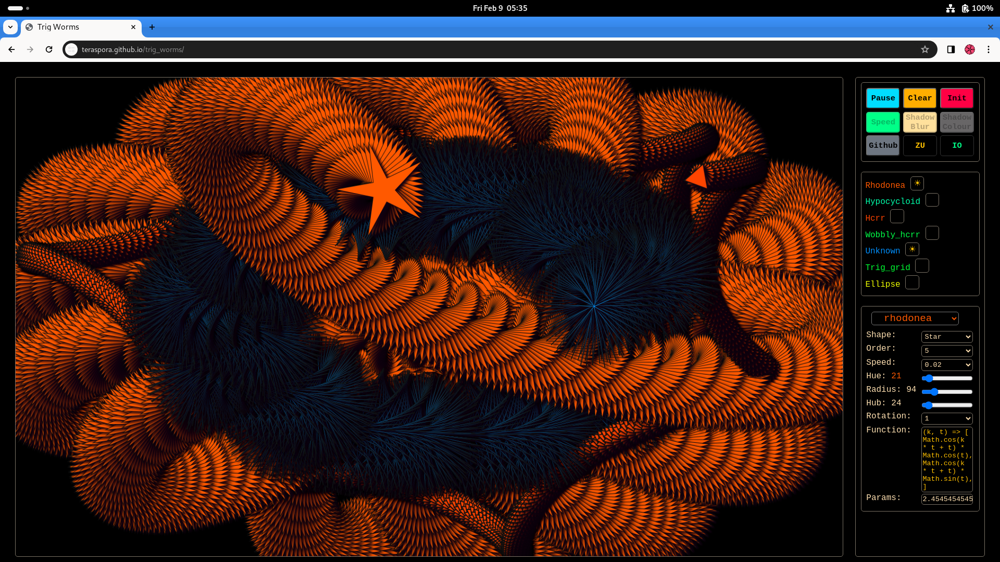
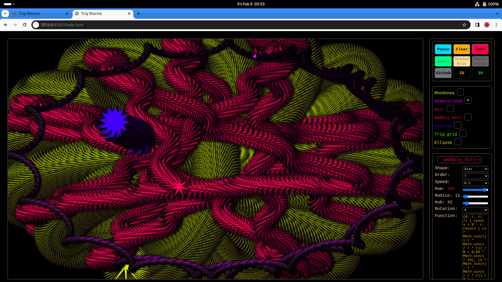
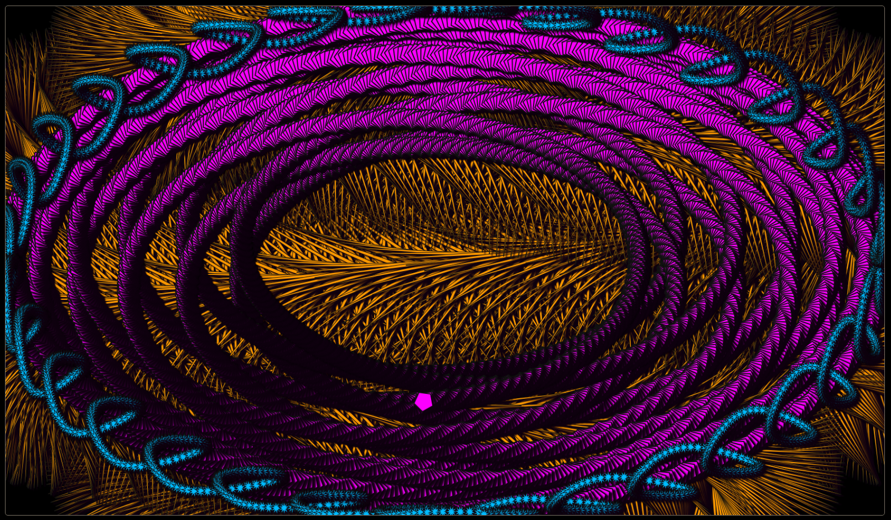

# Trig Worms

A pure Javascript application (with HTML and CSS of course!) that creates colourful animated art on an HTML canvas.

No external libraries at all have been used.

Users are in control, in the sense that they can change all sorts of parameters to vary the drawing.

Currently (February 2024) the app is in a nascent state.   There are doubtless many bugs, including some that I am aware of and all of which I intend to fix very soon!

I also have many more features I intend to implement, and will do so soon.

This `README` and the Help text will be expanded considerably in due course, so as to to document the app comprehensively.

In the meantime here are a couple of screenshots:

Do please try it out at <https://teraspora.github.io/trig_worms/>, but don't complain or file issues at this point!   And don't expect it to work on mobile:  that's not a priority at the moment, large screens are the target.   If it crashes your browser, sorry, tough!

## TODO:

### Current
- Fix bug where selecting a hidden curve messes the show/hide colours and that messes the active curve
- Keyboard shortcuts
- Update this `README` with full documentation
- Update Help pane
- Fix `init()` multiplying scenes
- Fix curve select not updating properly when
  - curve hidden
  - curve shown when all were hidden
  - etc.!
- Allow user to vary curve parameters
- Allow user to specify own functions
- Allow mirroring
- Allow save image and display all saved.   Local storage and user's local file system...
- Bubbles
- Other browsers - Safari showing sliders as black
- Mobile

### Longer-term
- Multiple canvases
- Refactor:
  - Organise inputs better
  - Use web components
- Mutate using shader

## Acknowledgements

- https://developer.mozilla.org/en-US/docs/Web/API/CanvasRenderingContext2D
- https://developer.mozilla.org/en-US/docs/Web/API/Canvas_API/Tutorial 
- https://bucephalus.org/text/CanvasHandbook/CanvasHandbook.html
- https://www.youtube.com/@Frankslaboratory for inspiring me about:
  - the OOP approach to animation;
  - managing particles;
  - drawing rotationally symmetrical objects by using rotation within context save/restore
  - use of vector and scalar fields (aka 'flow fields') to influence motion
- https://www.youtube.com/@Radu for inspiration regarding
  - video pixel manipulation
  - audio oscillators
- http://buildnewgames.com/ for some interesting articles, a bit old, but much still relevant

