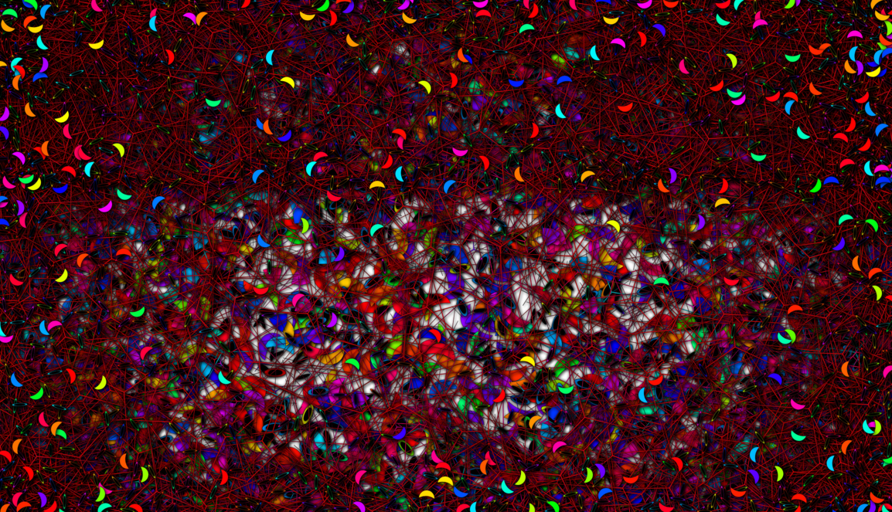

# Trig Worms

A pure Javascript application (with HTML and CSS of course!) that creates colourful animated art on an HTML canvas.

No external libraries at all have been used.

Users are in control, in the sense that they can change all sorts of parameters to vary the drawing.

Currently (March 7th 2024) I have implemented many features, and it it seems to work pretty well on Chrome and Firefox.   For Safari I need to add some CSS to make the range sliders look ok.

At this point I would love people to try it and give me feedback about bugs, useability, UX, UI, functionality, feature requests etc.!

This `README` and the Help text will be expanded considerably in due course, so as to to document the app comprehensively.

In the meantime here are a couple of screenshots:

  
  
  
  
   
 


- And check out this video I made from the app, adding my own piano accompaniment:
- <https://www.youtube.com/watch?v=L64Ztsul7bA>


Do please try it out at <https://teraspora.github.io/trig_worms/>!   But don't expect it to work great on iPhones:  that's not a priority at the moment, large screens are the target.   It seems to work reasonably on Android, but I have not checked in detail.
If it crashes your browser, sorry, tough!

## TODO:

### Current
- Keyboard shortcuts
- Update this `README` with full documentation
- Update Help pane
- Let user split canvas into 4, focus on current curve, with different parameters for each.
- Bubbles
- Other browsers - Safari showing sliders as black
- Mobile - No! - It works pretty ok on both Android and iPhone (curiously the range sliders on iPhone Safari look like those in Firefox, not invisible as in Safari desktop!)

### Commits to date (`git reflog` a/a 2024-03-07)
```
aebceb5 (HEAD -> main, origin/main) HEAD@{0}: commit: Enable video recording + save
1b85992 (curvefill) HEAD@{1}: merge curvefill: Fast-forward
90751ab HEAD@{2}: checkout: moving from curvefill to main
1b85992 (curvefill) HEAD@{3}: commit: Move ownership of fill (boolean) from shape to curve
90751ab HEAD@{4}: checkout: moving from main to curvefill
90751ab HEAD@{5}: commit: Add 'accent-color' to range sliders
a70b1ef (globalscale) HEAD@{6}: merge globalscale: Fast-forward
d75a97a HEAD@{7}: checkout: moving from globalscale to main
a70b1ef (globalscale) HEAD@{8}: commit: Implement global scale
d75a97a HEAD@{9}: checkout: moving from main to globalscale
d75a97a HEAD@{10}: merge globalscale: Fast-forward
5d4cd85 HEAD@{11}: checkout: moving from globalscale to main
d75a97a HEAD@{12}: commit: Move scale from shape to curve, as that what it belongs to really - user wants the same scale if they change the shape (usually)
5d4cd85 HEAD@{13}: checkout: moving from main to globalscale
5d4cd85 HEAD@{14}: commit: Curve updates; rename Debug button
e3d28e1 HEAD@{15}: commit: Remove folioid due to corner glitch
f905df6 HEAD@{16}: commit: On initialisation, make second and third active curves have polychrome stroke; add hue_seed instance property to Shape class to desync these
88aad2b HEAD@{17}: checkout: moving from imagepattern to main
273dbca (imagepattern) HEAD@{18}: commit: Implement canvas pattern as fill for curve drawing; but some issues so need a rethink
88aad2b HEAD@{19}: checkout: moving from main to imagepattern
88aad2b HEAD@{20}: checkout: moving from imageshape to main
65c194b (imageshape) HEAD@{21}: checkout: moving from main to imageshape
88aad2b HEAD@{22}: checkout: moving from imageshape to main
65c194b (imageshape) HEAD@{23}: commit: Implement ImageShape; but discontinuing with this atm, as allowing an image a colour for a shape is clearly the better way to go
88aad2b HEAD@{24}: checkout: moving from main to imageshape
88aad2b HEAD@{25}: checkout: moving from 2b7652dbfb44ba7b99f317a7a3769e47eebc6b76 to main
2b7652d HEAD@{26}: checkout: moving from main to 2b7652d
88aad2b HEAD@{27}: checkout: moving from imageshape to main
88aad2b HEAD@{28}: checkout: moving from main to imageshape
88aad2b HEAD@{29}: commit: Add some curves, modify params/speed for others
2b7652d HEAD@{30}: commit: Minor tweaks
e15bc17 HEAD@{31}: commit: Small tweaks
e084379 HEAD@{32}: commit: Fix bug with scaling
bf084d5 HEAD@{33}: commit: Add UI to change scale
1dbefef HEAD@{34}: commit: Tidy code, add header comments
c0f81d0 (moonplay) HEAD@{35}: merge moonplay: Fast-forward
59cb00c (windmill_voronoi) HEAD@{36}: checkout: moving from moonplay to main
c0f81d0 (moonplay) HEAD@{37}: commit: Add cardioid, tidy code, add comments
59cb00c (windmill_voronoi) HEAD@{38}: checkout: moving from main to moonplay
59cb00c (windmill_voronoi) HEAD@{39}: merge windmill_voronoi: Fast-forward
8babb61 HEAD@{40}: checkout: moving from windmill_voronoi to main
59cb00c (windmill_voronoi) HEAD@{41}: commit: After removing Voronoi and Test classes
b2affc7 HEAD@{42}: commit: Add Windmill
8babb61 HEAD@{43}: checkout: moving from main to windmill_voronoi
8babb61 HEAD@{44}: commit: Fix confused ► and ▼ for toggling sections
b3bacfd HEAD@{45}: commit: Put function settings behind show/hide dropdown toggle
49fefab HEAD@{46}: commit: Refine some curves; add back 0 as eccentricity setting
c5d8795 HEAD@{47}: commit: Implement polychrome stroke
06a0b67 HEAD@{48}: commit: Fix small bugs
7abaae1 HEAD@{49}: commit: Implement auxiliary curves
5a5c775 HEAD@{50}: commit: Working; before aux curve full implementation
f6ea73f HEAD@{51}: commit: Fix so background gets saved; this means canvas has to be cleared when changing background, as it has to be painted over existing pixels
a6cf2cf HEAD@{52}: checkout: moving from test_cissoids_etc to main
cdc1f68 (test_cissoids_etc) HEAD@{53}: checkout: moving from main to test_cissoids_etc
a6cf2cf HEAD@{54}: reset: moving to a6cf2cf
cdc1f68 (test_cissoids_etc) HEAD@{55}: merge test_cissoids_etc: Fast-forward
a6cf2cf HEAD@{56}: reset: moving to a6cf2cf
a6cf2cf HEAD@{57}: checkout: moving from a6cf2cf8372b7723469323f186d3b37093b126e7 to main
a6cf2cf HEAD@{58}: checkout: moving from main to a6cf2cf
a6cf2cf HEAD@{59}: checkout: moving from test_cissoids_etc to main
cdc1f68 (test_cissoids_etc) HEAD@{60}: commit: Test combining curves on test_cissoids_etc branch
a6cf2cf HEAD@{61}: checkout: moving from main to test_cissoids_etc
a6cf2cf HEAD@{62}: commit: Extend speed range
7351984 HEAD@{63}: commit: Add advanced section
5a11a28 HEAD@{64}: commit: Toggle show/hide for Curves and Active Curve sections
3a95057 HEAD@{65}: commit: Halve progress delta
6452673 HEAD@{66}: commit: Correct initial mirror button text
a8f2c81 HEAD@{67}: commit: Start mirrored and multicoloured
08ff775 HEAD@{68}: commit: Compress images, update README
5ae8e18 HEAD@{69}: commit: Much new functionality - control of fill and stroke etc.; update README with new images
43f3585 HEAD@{70}: commit: Update curve names; small tweaks
b7636bf HEAD@{71}: commit: Implement param editing; a few other bits
43753db HEAD@{72}: commit: Update README
b66d854 HEAD@{73}: commit: Update README with new images; add transform to top links on hover; prepare for user param editing
0e4442a HEAD@{74}: commit: Fix bug after renaming curve label ids to just curve name
2a8c6eb HEAD@{75}: commit: Tweak background change settings
4b552b5 HEAD@{76}: commit (amend): Add underline for current curve in listing
ab4057c HEAD@{77}: commit: Add underline for active curve in listing
b870c02 HEAD@{78}: commit: Tweak blur
02e0296 HEAD@{79}: commit: Blur Play/Pause button after activation
6d29743 HEAD@{80}: commit: Fix Ring radius bug
384b3ba HEAD@{81}: checkout: moving from 7728d0d68172795e2b94506cb927b693e54d371b to main
7728d0d HEAD@{82}: checkout: moving from main to 7728d0d
384b3ba HEAD@{83}: commit: Sort curve selection
70d123a HEAD@{84}: commit: Abolish init() due to multiple issues and lack of need!
d4df6c5 HEAD@{85}: commit: Let ShapeScene constructor select 3 curves randomly for initial display
54432c0 HEAD@{86}: commit: Add background change button and implement help button properly, and fix 'Space' for pause/play
8b9579b HEAD@{87}: commit: Implement Polychrome speed control
f536779 HEAD@{88}: commit: Fix a few bugs incl. debug when paused not requesting animation frame; add button to save drawing
f448928 HEAD@{89}: commit: Push debug false
43dc35f HEAD@{90}: commit: Fix init bug; reorder/sort buttons; fix updating curve select colour.
b67ef04 HEAD@{91}: commit: Bugfix: reinstate non-debug setting of current curve; also improve code in ShapeScene constructor
07358c9 HEAD@{92}: commit: Set debug false for live push
daabd25 HEAD@{93}: commit: Redo debug
cb45772 HEAD@{94}: commit: Add concave and concave_ex curves, modify debug functionality, adjust wave-frequency bounds and step
ac67a8a HEAD@{95}: commit: Add waviness
7728d0d HEAD@{96}: commit: Reduce canvas:controls width ratio from 6:1 to 4:1 so controls are easier to use
6d81446 HEAD@{97}: commit: Add pulsing, add Moon class and fix 1 or 2 bugs
ef99d4c HEAD@{98}: commit: Renaming, reorganisation etc.
dd0e408 HEAD@{99}: commit: Tweaks
82a0089 HEAD@{100}: commit: Update README; small js tweaks
bc5788e HEAD@{101}: commit: Get curve names from keys
51b086d HEAD@{102}: checkout: moving from ui_fix to main
f5cd95b (ui_fix) HEAD@{103}: commit: Get curve names from keys
ea09d21 HEAD@{104}: commit: UI needs fixing: new branch ui-fix, off main, first commit
51b086d HEAD@{105}: checkout: moving from main to ui_fix
51b086d HEAD@{106}: commit: Add Ring Shape; Adjust UI; remove volatile and add multicoloured button 'Chromute'
84f3b2b HEAD@{107}: commit: Tweak curve parameters
698722b HEAD@{108}: commit: Set the newly-unhidden curve to be the current curve
e96a6be HEAD@{109}: commit: Add many curves, fix logic bug, allow scroll on controls
2c8f775 HEAD@{110}: commit: Fix errors (don't set oscillator frequency if curve hidden, as x and y are undefined. Moved to outside the if block
962da05 HEAD@{111}: commit: Improve audio
579114a HEAD@{112}: commit: Implement all buttons except 'Global'; some bugs yet to fix, see README
0058b3d HEAD@{113}: commit: Add media for README
a4943c3 HEAD@{114}: commit: Update README
ff2bfef HEAD@{115}: commit: Details; much more to do
a3eb6ca HEAD@{116}: commit: All param inputs working; hub display fixed; removed unused class members
7963381 HEAD@{117}: commit: Nearly all param inputs working; nine buttons in place; styling improved
2f888f2 HEAD@{118}: commit: Ongoing work binding UI to params properly partially done
cc273cf HEAD@{119}: commit (amend): More styling; now about to refactor params in UI to <select>s. Note init() on resize still doubling curves
907b9e6 HEAD@{120}: commit: More styling; now about to refactor params in UI to <select>s.
537bfab HEAD@{121}: commit: Refactor colour from shape to curve
8204eef HEAD@{122}: commit: Change params details to grid; now to refactor colour from shape to curve
5e58755 HEAD@{123}: commit: Controls partially done
325600b HEAD@{124}: commit: Add controls / curve checkboxes; now to refactor curves to a POJO
e0aeeb9 HEAD@{125}: commit: Sort various small issues
003d56f HEAD@{126}: commit: Now with four curves and an optional oscillator
beac80d HEAD@{127}: commit: Add mutating colours
c129957 HEAD@{128}: commit: Add help
a04c15a (flatcp) HEAD@{129}: merge flatcp: Fast-forward
fdc1b4e HEAD@{130}: checkout: moving from flatcp to main
a04c15a (flatcp) HEAD@{131}: commit: Refine comments, details etc.
97d8bb1 HEAD@{132}: commit: Set params for three curves, looking good
7dcd18b (follow_curve_path) HEAD@{133}: checkout: moving from follow_curve_path to flatcp
7dcd18b (follow_curve_path) HEAD@{134}: commit: Drawing nice paths
e1c9ccd HEAD@{135}: commit: Very nice, 3 strands rotating now
441b979 HEAD@{136}: commit: Nice, drawing three curves
984282f HEAD@{137}: commit: Interesting effect but not as intended!
fdc1b4e HEAD@{138}: checkout: moving from main to follow_curve_path
fdc1b4e HEAD@{139}: commit: Add more user keyboard controls; factor out common stuff of Star and Polygon to parent class Shape
7d652ae HEAD@{140}: commit: Bones of a drawing app
d571dda HEAD@{141}: commit: Lovely multicoloured furry tail, with rotation
bd3b4e7 HEAD@{142}: commit (initial): Initial commit: draw with shapes
```


### Longer-term
- Multiple canvases
- Refactor:
  - Organise inputs better
  - Use web components
- Mutate using shader
- Consider using Svelte

## Acknowledgements

- https://developer.mozilla.org/en-US/docs/Web/API/CanvasRenderingContext2D
- https://developer.mozilla.org/en-US/docs/Web/API/Canvas_API/Tutorial 
- https://bucephalus.org/text/CanvasHandbook/CanvasHandbook.html
- https://www.youtube.com/@Frankslaboratory for inspiring me about:
  - the OOP approach to animation;
  - managing particles;
  - drawing rotationally symmetrical objects by using rotation within context save/restore
  - use of vector and scalar fields (aka 'flow fields') to influence motion
- https://www.youtube.com/@Radu for inspiration regarding
  - video pixel manipulation
  - audio oscillators
- http://buildnewgames.com/ for some interesting articles, a bit old, but much still relevant

